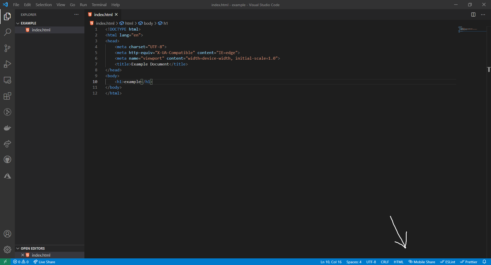

# live-server-qr
Scan a QR Code to open your live server up in your mobile browser.

## Requirements

* [LiveServer](https://marketplace.visualstudio.com/items?itemName=ritwickdey.LiveServer)

## Getting Started
Once you have the extension installed, open your live server.  
Click this icon to generate a qr code to be scanned and opened in your mobile browser.

## Release Notes

* ### Version 0.0.2
  * Fixed a bug with folders.
* ### Version 0.0.1
  * Initial Release

## LICENSE
This extension is licensed under the [MIT License](LICENSE)